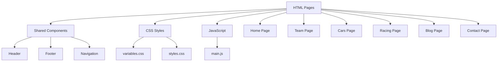

# Pikzilla Racing System Patterns

## Architecture Overview

The Pikzilla Racing website follows a modern static HTML architecture with CSS and JavaScript. The system is organized using a page-based approach with shared components and styles.



## Core Design Patterns

### Page Structure

The project follows a consistent page structure:

1. **Shared Elements**: Included in all pages
   - Header: Navigation and branding
   - Footer: Contact information and secondary navigation

2. **Page-Specific Content**: Unique to each page
   - Home: Landing page with featured content
   - Team: Team member profiles and information
   - Cars: Racing vehicles and specifications
   - Racing: Upcoming and past racing events
   - Blog: News articles and team updates
   - Contact: Contact form and information

3. **UI Elements**: Reusable elements used across multiple pages
   - Buttons, cards, forms, and other interface elements
   - Styled consistently using shared CSS variables

### Styling Approach

The project uses a CSS-based styling approach with:

1. **CSS Variables**: Defined in `variables.css` for consistent theming
2. **Global Styles**: Main styles defined in `styles.css`
3. **Responsive Design**: Media queries for different screen sizes

```css
/* Example of CSS Variables Pattern */
:root {
  /* Color Palette */
  --color-primary: #FF2C01; /* Official Red */
  --color-secondary: #E9E9E9; /* Official Light Grey */
  --color-tertiary: #E9E9E9; /* Official Light Grey */
  --color-background: #FFFFFF; /* Official White */
  --color-text: #000000; /* Official Black */
  --color-accent: #FF7301; /* Official Orange */
  --color-border: #E9E9E9; /* Official Light Grey */
  
  /* Typography */
  --font-family-primary: 'Manrope', sans-serif;
  --font-family-secondary: 'Manrope', sans-serif;
  
  /* Font Sizes based on Figma Text Styles */
  --font-size-button: 0.75rem;    /* 12px */
  --font-size-menu: 0.75rem;      /* 12px */
  --font-size-headline: 4.375rem;  /* 70px */
  
  /* Line Heights */
  --line-height-auto: 1.5;
  --line-height-headline: 80px;
  
  /* ... other variables ... */
}
```

### Typography Pattern

The project uses a consistent typography system based on Figma text styles:

```css
/* Text Style Classes */
.text-headline {
  font-family: var(--font-family-primary);
  font-size: var(--font-size-headline);
  line-height: var(--line-height-headline);
  font-weight: var(--font-weight-bold);
}

.text-paragraph-1 {
  font-family: var(--font-family-primary);
  font-size: var(--font-size-paragraph-1);
  line-height: var(--line-height-auto);
  font-weight: var(--font-weight-regular);
}

/* ... other text styles ... */
```

These text style classes can be applied to elements to ensure consistent typography throughout the site.

### Navigation Pattern

The website uses standard HTML navigation with consistent linking between pages:

```html
<!-- Example Navigation Pattern -->
<nav class="main-nav">
  <ul>
    <li><a href="index.html" class="active">Home</a></li>
    <li><a href="team.html">Team</a></li>
    <li><a href="cars.html">Cars</a></li>
    <li><a href="racing.html">Racing</a></li>
    <li><a href="blog.html">Blog</a></li>
    <li><a href="contact.html">Contact</a></li>
  </ul>
</nav>
```

## Repository and Deployment Structure

### File Structure

The project follows a clean, organized file structure in the root directory:

```
Pikzilla-Racing/
├── index.html         # Home page
├── team.html          # Team page
├── cars.html          # Cars page
├── racing.html        # Racing page
├── blog.html          # Blog page
├── contact.html       # Contact page
├── assets/            # Static assets organized by type
│   ├── Icons/
│   │   ├── Blog News/
│   │   ├── Home Page/
│   │   └── Team Page/
│   ├── Images/
│   │   ├── Blog News/
│   │   ├── Car Page/
│   │   ├── Contact/
│   │   ├── Home Page/
│   │   ├── Racing Page/
│   │   └── Team Page/
│   ├── Logo/
│   │   ├── Pikzilla Head.svg
│   │   ├── Pikzilla Logo.svg
│   │   └── Pikzilla Text.svg
│   └── Vectors/
│       ├── Border.svg
│       ├── Mclaren.svg
│       └── Social Media.svg
├── css/               # Stylesheets
│   ├── styles.css     # Main stylesheet
│   └── variables.css  # CSS variables for theming
├── js/                # JavaScript files
│   └── main.js        # Main JavaScript functionality
└── docs/              # Documentation and development resources
    ├── memory-bank/   # Project documentation
    ├── visual-references/ # Design references
    └── figma-token.txt # Figma access token (gitignored)
```

### GitHub Pages Deployment

The website is deployed using GitHub Pages with the following configuration:

1. **Source**: Root directory of the master branch
2. **URL**: https://leopbgit.github.io/Pikzilla-Racing/
3. **Workflow**: 
   - All development work is done directly in the root directory
   - Changes are committed and pushed to the master branch
   - GitHub Pages automatically rebuilds and deploys the site

> **Critical Pattern**: Always maintain all website files in the root directory. Never create duplicate copies of files in subdirectories, as this can lead to confusion and deployment issues. All paths in HTML, CSS, and JavaScript files should be relative to the root directory.

## Key Technical Decisions

### 1. HTML, CSS, and JavaScript

The decision to use standard web technologies provides:
- Broad compatibility across browsers
- Simpler development and maintenance
- Faster loading times
- No build step required

### 2. CSS for Styling

Using CSS files for styling:
- Keeps concerns separated (structure vs. presentation)
- Allows for easier customization and theming
- Provides better performance for static styles
- Familiar approach for developers with CSS experience

### 3. Page-Based Architecture

The page-based approach provides:
- Simplicity in development and maintenance
- Direct mapping between URLs and HTML files
- Easy deployment to any web server
- No client-side routing complexity

### 4. Static Site

The website is implemented as a static site:
- Fast initial load times
- No need for a backend server for basic functionality
- Can be hosted on any static hosting service
- Excellent SEO capabilities

## Responsive Design Patterns

The website implements responsive design using:

1. **Fluid Layouts**: Using percentage-based widths and flexible grids
2. **Media Queries**: Adjusting layouts based on screen size
3. **Mobile-First Approach**: Designing for mobile and enhancing for larger screens
4. **Flexible Images**: Images that scale with their containers
5. **CSS Grid and Flexbox**: For complex, responsive layouts
6. **Consistent Spacing**: Standard spacing rules, including 150px spacing before the footer on all pages

```css
/* Example Responsive Pattern */
.container {
  width: 100%;
  max-width: var(--container-max-width);
  margin: 0 auto;
  padding: var(--spacing-md);
}

/* Spacing Patterns */
.footer {
  margin-top: 150px; /* Standard spacing before footer on all pages */
}

h1, h2, h3, h4, h5, h6 {
  margin-bottom: var(--spacing-title-to-paragraph); /* 20px spacing between titles and paragraphs */
}

p + .btn, 
p + button, 
.btn-container {
  margin-top: var(--spacing-paragraph-to-button); /* 20px spacing between paragraphs and buttons */
}

.section-border {
  margin-bottom: var(--spacing-2xl); /* 40px spacing below the border.svg vector */
}

@media (max-width: 768px) {
  .grid {
    grid-template-columns: 1fr;
  }
}
```

## Performance Optimization Patterns

1. **Minimal JavaScript**: Using JavaScript only where necessary
2. **Image Optimization**: Using appropriate image formats and sizes
3. **CSS Organization**: Structuring CSS for efficiency
4. **Resource Minification**: Reducing file sizes for production
5. **Browser Caching**: Leveraging browser caching for static assets

## Design System Patterns

1. **Flat Design**: No rounded corners on any UI elements (border-radius: 0)
   - All buttons, cards, images, containers, inputs, etc. must have sharp edges
   - This creates a consistent, modern aesthetic throughout the site
   - Implemented via CSS variables with all border-radius values set to 0
   ```css
   /* Border radius variables */
   --border-radius-sm: 0;
   --border-radius-md: 0;
   --border-radius-lg: 0;
   --border-radius-full: 0;
   ```

## Accessibility Patterns

1. **Semantic HTML**: Using appropriate HTML elements
2. **ARIA Attributes**: Enhancing accessibility for screen readers
3. **Keyboard Navigation**: Ensuring all interactive elements are keyboard accessible
4. **Color Contrast**: Meeting WCAG guidelines for text readability
5. **Focus Management**: Providing visual indicators for focused elements

## Future Extension Points

The architecture is designed to allow for future extensions:

1. **Backend Integration**: Adding server-side processing for forms
2. **Dynamic Content**: Incorporating content management capabilities
3. **Enhanced Interactivity**: Adding more JavaScript functionality
4. **E-commerce**: Adding merchandise or ticket sales functionality
5. **Analytics**: Implementing tracking for user behavior
