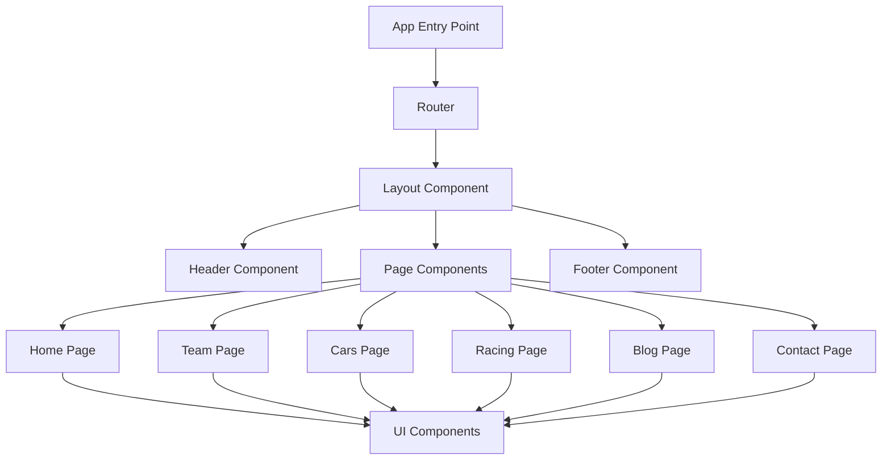

# Pikzilla Racing System Patterns

## Architecture Overview

The Pikzilla Racing website follows a modern React-based architecture with TypeScript for type safety. The system is organized using a component-based approach with clear separation of concerns.



## Core Design Patterns

### Component Structure

The project follows a hierarchical component structure:

1. **Layout Components**: Define the overall structure of the page
   - Header: Navigation and branding
   - Footer: Contact information and secondary navigation
   - Layout: Container that wraps all pages with common elements

2. **Page Components**: Represent each major section of the website
   - HomePage: Landing page with featured content
   - TeamPage: Team member profiles and information
   - CarsPage: Racing vehicles and specifications
   - RacingPage: Upcoming and past racing events
   - BlogPage: News articles and team updates
   - ContactPage: Contact form and information

3. **UI Components**: Reusable elements used across multiple pages
   - Buttons, cards, forms, and other interface elements
   - Styled consistently using shared CSS variables

### State Management

The application uses React's built-in state management with hooks:

- `useState` for component-level state
- `useEffect` for side effects and lifecycle management
- Props for passing data between components

For more complex state management needs, the application could be extended with Context API or Redux.

### Styling Approach

The project uses a CSS-based styling approach with:

1. **CSS Variables**: Defined in `variables.css` for consistent theming
2. **Component-Specific CSS**: Each component has its own CSS file
3. **Responsive Design**: Media queries for different screen sizes
4. **Global Styles**: Base styles defined in `global.css`

```css
/* Example of CSS Variables Pattern */
:root {
  --color-primary: #FF4C29;
  --color-secondary: #082032;
  --color-tertiary: #2C394B;
  --color-background: #334756;
  --color-text: #FFFFFF;
  /* ... other variables ... */
}
```

### Routing Pattern

The application uses React Router for navigation:

```typescript
// Example Routing Pattern
<Routes>
  <Route path="/" element={<Layout />}>
    <Route index element={<HomePage />} />
    <Route path="team" element={<TeamPage />} />
    <Route path="cars" element={<CarsPage />} />
    <Route path="racing" element={<RacingPage />} />
    <Route path="blog" element={<BlogPage />} />
    <Route path="contact" element={<ContactPage />} />
    <Route path="*" element={<NotFound />} />
  </Route>
</Routes>
```

## File Structure

The project follows a feature-based file structure:

```
pikzilla-racing/
├── public/
│   ├── assets/
│   │   ├── Icons/
│   │   ├── Images/
│   │   ├── Logo/
│   │   └── Vectors/
│   └── index.html
├── src/
│   ├── assets/
│   ├── components/
│   │   ├── common/
│   │   │   ├── Header.tsx
│   │   │   ├── Header.css
│   │   │   ├── Footer.tsx
│   │   │   ├── Footer.css
│   │   │   ├── Layout.tsx
│   │   │   └── Layout.css
│   │   ├── home/
│   │   ├── team/
│   │   ├── cars/
│   │   ├── racing/
│   │   ├── blog/
│   │   └── contact/
│   ├── pages/
│   │   ├── HomePage.tsx
│   │   ├── HomePage.css
│   │   ├── TeamPage.tsx
│   │   ├── TeamPage.css
│   │   ├── CarsPage.tsx
│   │   ├── CarsPage.css
│   │   ├── RacingPage.tsx
│   │   ├── RacingPage.css
│   │   ├── BlogPage.tsx
│   │   ├── BlogPage.css
│   │   ├── ContactPage.tsx
│   │   └── ContactPage.css
│   ├── styles/
│   │   ├── global.css
│   │   └── variables.css
│   ├── types/
│   │   └── global.d.ts
│   ├── App.tsx
│   ├── App.css
│   └── main.tsx
├── package.json
└── tsconfig.json
```

## Key Technical Decisions

### 1. React + TypeScript

The decision to use React with TypeScript provides:
- Type safety and better developer experience
- Improved code quality and fewer runtime errors
- Better documentation through type definitions
- Enhanced IDE support for code completion and error checking

### 2. CSS for Styling

Using CSS files for styling instead of CSS-in-JS libraries:
- Keeps concerns separated (structure vs. presentation)
- Allows for easier customization and theming
- Provides better performance for static styles
- Familiar approach for developers with CSS experience

### 3. Component-Based Architecture

The component-based approach provides:
- Reusability of UI elements across pages
- Easier maintenance and testing
- Clear separation of concerns
- Scalability as the application grows

### 4. Static Site with Client-Side Routing

The website is implemented as a static site with client-side routing:
- Fast initial load times
- Smooth transitions between pages
- No need for a backend server for basic functionality
- Can be hosted on any static hosting service

## Responsive Design Patterns

The website implements responsive design using:

1. **Fluid Layouts**: Using percentage-based widths and flexible grids
2. **Media Queries**: Adjusting layouts based on screen size
3. **Mobile-First Approach**: Designing for mobile and enhancing for larger screens
4. **Flexible Images**: Images that scale with their containers
5. **CSS Grid and Flexbox**: For complex, responsive layouts

```css
/* Example Responsive Pattern */
.container {
  width: 100%;
  max-width: var(--container-max-width);
  margin: 0 auto;
  padding: var(--spacing-md);
}

@media (max-width: 768px) {
  .grid {
    grid-template-columns: 1fr;
  }
}
```

## Performance Optimization Patterns

1. **Code Splitting**: Loading components only when needed
2. **Image Optimization**: Using appropriate image formats and sizes
3. **Lazy Loading**: Deferring non-critical resources
4. **Minimizing Bundle Size**: Avoiding unnecessary dependencies
5. **Efficient Rendering**: Preventing unnecessary re-renders

## Accessibility Patterns

1. **Semantic HTML**: Using appropriate HTML elements
2. **ARIA Attributes**: Enhancing accessibility for screen readers
3. **Keyboard Navigation**: Ensuring all interactive elements are keyboard accessible
4. **Color Contrast**: Meeting WCAG guidelines for text readability
5. **Focus Management**: Providing visual indicators for focused elements

## Future Extension Points

The architecture is designed to allow for future extensions:

1. **Backend Integration**: Adding API calls for dynamic content
2. **Authentication**: Adding user accounts and protected routes
3. **CMS Integration**: Connecting to a content management system
4. **E-commerce**: Adding merchandise or ticket sales functionality
5. **Analytics**: Implementing tracking for user behavior
