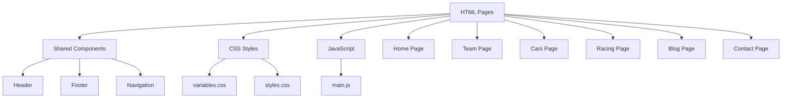

# Pikzilla Racing System Patterns

## Architecture Overview

The Pikzilla Racing website follows a modern static HTML architecture with CSS and JavaScript. The system is organized using a page-based approach with shared components and styles.



## Core Design Patterns

### Page Structure

The project follows a consistent page structure:

1. **Shared Elements**: Included in all pages
   - Header: Navigation and branding
   - Footer: Contact information and secondary navigation

2. **Page-Specific Content**: Unique to each page
   - Home: Landing page with featured content
   - Team: Team member profiles and information
   - Cars: Racing vehicles and specifications
   - Racing: Upcoming and past racing events
   - Blog: News articles and team updates
   - Contact: Contact form and information

3. **UI Elements**: Reusable elements used across multiple pages
   - Buttons, cards, forms, and other interface elements
   - Styled consistently using shared CSS variables

### Styling Approach

The project uses a CSS-based styling approach with:

1. **CSS Variables**: Defined in `variables.css` for consistent theming
2. **Global Styles**: Main styles defined in `styles.css`
3. **Responsive Design**: Media queries for different screen sizes

```css
/* Example of CSS Variables Pattern */
:root {
  /* Color Palette */
  --color-primary: #FF4C29;
  --color-secondary: #082032;
  --color-tertiary: #2C394B;
  --color-background: #334756;
  --color-text: #FFFFFF;
  
  /* Typography */
  --font-family-primary: 'Manrope', sans-serif;
  --font-family-secondary: 'Manrope', sans-serif;
  
  /* Font Sizes based on Figma Text Styles */
  --font-size-button: 0.75rem;    /* 12px */
  --font-size-menu: 0.75rem;      /* 12px */
  --font-size-headline: 4.375rem;  /* 70px */
  
  /* Line Heights */
  --line-height-auto: 1.5;
  --line-height-headline: 80px;
  
  /* ... other variables ... */
}
```

### Typography Pattern

The project uses a consistent typography system based on Figma text styles:

```css
/* Text Style Classes */
.text-headline {
  font-family: var(--font-family-primary);
  font-size: var(--font-size-headline);
  line-height: var(--line-height-headline);
  font-weight: var(--font-weight-bold);
}

.text-paragraph-1 {
  font-family: var(--font-family-primary);
  font-size: var(--font-size-paragraph-1);
  line-height: var(--line-height-auto);
  font-weight: var(--font-weight-regular);
}

/* ... other text styles ... */
```

These text style classes can be applied to elements to ensure consistent typography throughout the site.

### Navigation Pattern

The website uses standard HTML navigation with consistent linking between pages:

```html
<!-- Example Navigation Pattern -->
<nav class="main-nav">
  <ul>
    <li><a href="index.html" class="active">Home</a></li>
    <li><a href="team.html">Team</a></li>
    <li><a href="cars.html">Cars</a></li>
    <li><a href="racing.html">Racing</a></li>
    <li><a href="blog.html">Blog</a></li>
    <li><a href="contact.html">Contact</a></li>
  </ul>
</nav>
```

## File Structure

The project follows a clean, organized file structure:

```
pikzilla-static/
├── assets/
│   ├── Icons/
│   │   ├── Blog News/
│   │   ├── Home Page/
│   │   └── Team Page/
│   ├── Images/
│   │   ├── Blog News/
│   │   ├── Car Page/
│   │   ├── Contact/
│   │   ├── Home Page/
│   │   ├── Racing Page/
│   │   └── Team Page/
│   ├── Logo/
│   │   ├── Pikzilla Head.svg
│   │   ├── Pikzilla Logo.svg
│   │   └── Pikzilla Text.svg
│   └── Vectors/
│       ├── Border.svg
│       ├── Mclaren.svg
│       └── Social Media.svg
├── css/
│   ├── styles.css
│   └── variables.css
├── js/
│   └── main.js
├── index.html
├── team.html
├── cars.html
├── racing.html
├── blog.html
└── contact.html
```

## Key Technical Decisions

### 1. HTML, CSS, and JavaScript

The decision to use standard web technologies provides:
- Broad compatibility across browsers
- Simpler development and maintenance
- Faster loading times
- No build step required

### 2. CSS for Styling

Using CSS files for styling:
- Keeps concerns separated (structure vs. presentation)
- Allows for easier customization and theming
- Provides better performance for static styles
- Familiar approach for developers with CSS experience

### 3. Page-Based Architecture

The page-based approach provides:
- Simplicity in development and maintenance
- Direct mapping between URLs and HTML files
- Easy deployment to any web server
- No client-side routing complexity

### 4. Static Site

The website is implemented as a static site:
- Fast initial load times
- No need for a backend server for basic functionality
- Can be hosted on any static hosting service
- Excellent SEO capabilities

## Responsive Design Patterns

The website implements responsive design using:

1. **Fluid Layouts**: Using percentage-based widths and flexible grids
2. **Media Queries**: Adjusting layouts based on screen size
3. **Mobile-First Approach**: Designing for mobile and enhancing for larger screens
4. **Flexible Images**: Images that scale with their containers
5. **CSS Grid and Flexbox**: For complex, responsive layouts

```css
/* Example Responsive Pattern */
.container {
  width: 100%;
  max-width: var(--container-max-width);
  margin: 0 auto;
  padding: var(--spacing-md);
}

@media (max-width: 768px) {
  .grid {
    grid-template-columns: 1fr;
  }
}
```

## Performance Optimization Patterns

1. **Minimal JavaScript**: Using JavaScript only where necessary
2. **Image Optimization**: Using appropriate image formats and sizes
3. **CSS Organization**: Structuring CSS for efficiency
4. **Resource Minification**: Reducing file sizes for production
5. **Browser Caching**: Leveraging browser caching for static assets

## Accessibility Patterns

1. **Semantic HTML**: Using appropriate HTML elements
2. **ARIA Attributes**: Enhancing accessibility for screen readers
3. **Keyboard Navigation**: Ensuring all interactive elements are keyboard accessible
4. **Color Contrast**: Meeting WCAG guidelines for text readability
5. **Focus Management**: Providing visual indicators for focused elements

## Future Extension Points

The architecture is designed to allow for future extensions:

1. **Backend Integration**: Adding server-side processing for forms
2. **Dynamic Content**: Incorporating content management capabilities
3. **Enhanced Interactivity**: Adding more JavaScript functionality
4. **E-commerce**: Adding merchandise or ticket sales functionality
5. **Analytics**: Implementing tracking for user behavior
